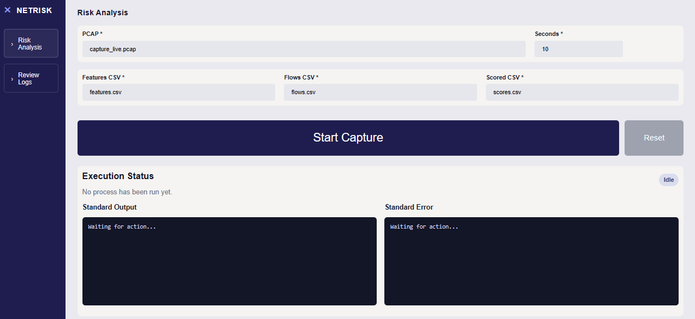
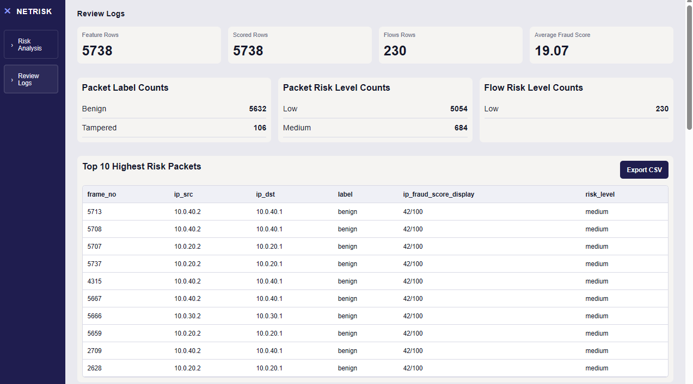
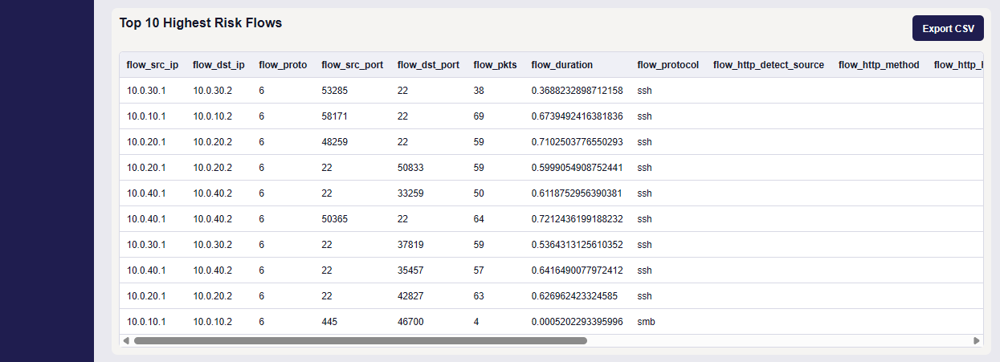
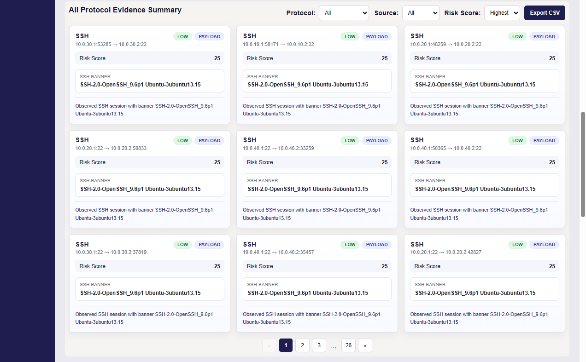
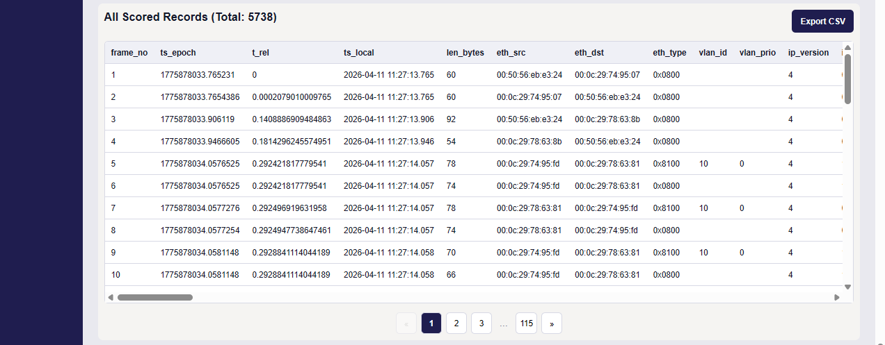
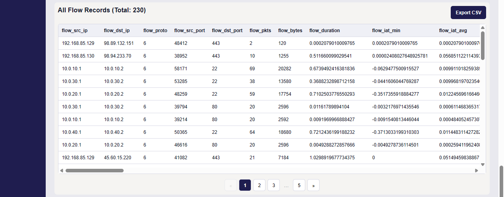
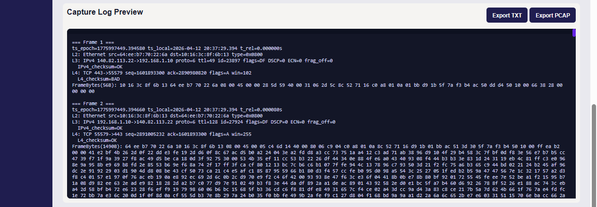

### 0570: Network Traffic Frame Integrity & Threat Classification Header & Flow Analysis with Prototype Detector

A web-based system for **real-time network traffic analysis, frame integrity verification, and threat classification** using:

- L2–L4 header analysis (Scapy)
- Flow-based behavioural analysis
- Machine Learning (Random Forest)
- Interactive SOC-style dashboard (FastAPI)

---

## 1) System Overview

NetRisk is designed as a **lightweight header-based detection system** that overcomes limitations of traditional payload-based security tools.

Unlike DPI systems, this system:

- Works even on **encrypted traffic**
- Detects **frame-level anomalies**
- Provides **explainable risk scoring**

### Core Capabilities

- Live packet capture (PCAP generation)
- L2–L4 header feature extraction
- Flow generation & aggregation
- Protocol identification (HTTP, TLS, SSH, SMB)
- TCP behaviour analysis (SYN/ACK patterns)
- Machine learning classification
- IP risk enrichment
- SOC-style dashboard visualization
- Export results (CSV / TXT / PCAP)

---

## Why This System Matters

Traditional network security systems face critical limitations:

- Deep Packet Inspection (DPI) fails on encrypted traffic
- Flow-based systems (NetFlow) ignore L2 header integrity
- Advanced tools like Zeek may drop malformed packets (e.g., invalid checksum)

This creates a **visibility gap in L2–L4 header integrity verification**.

NetRisk addresses this gap by:

- Analysing raw packet headers (L2–L4)
- Detecting structural anomalies
- Classifying threats without relying on payload data

---

## Comparison with Existing Systems

| Feature | DPI (Snort/Suricata) | NetFlow | Zeek | NetRisk |
|--------|---------------------|--------|------|--------|
| Works on encrypted traffic | ❌ | ✅ | ✅ | ✅ |
| L2 header analysis | ❌ | ❌ | ⚠️ Partial | ✅ |
| Detect malformed frames | ❌ | ❌ | ❌ | ✅ |
| Payload required | ✅ | ❌ | ❌ | ❌ |
| Explainable scoring | ❌ | ❌ | ⚠️ | ✅ |

---

## 2) System Architecture

The system follows a multi-stage detection pipeline:

```text
[Packet Capture]
        ↓
[Feature Extraction (L2–L4)]
        ↓
[Flow Generation & Aggregation]
        ↓
[Protocol Detection + TCP Behaviour Analysis]
        ↓
[Machine Learning Classification]
        ↓
[Risk Scoring (API + Heuristic)]
        ↓
[Dashboard Visualization & Export]
```

---

## Dashboard Preview


SOC-style dashboard showing packet and flow risk analysis
<!-- 
### Review Logs Page





 -->

---

## 3) Project Structure

```text
packet-header_n_frame-analysis/
├── app.py                  # FastAPI backend (API + dashboard routes)
├── fyp1.py                 # Packet capture + feature extraction engine
├── random_forest/
│   └── rf_model.joblib     # Trained ML model

├── templates/
│   └── index.html          # Main dashboard UI

├── static/
│   ├── app.js              # Frontend logic (API calls, rendering)
│   ├── style.css           # UI styling (if exists)

├── data/                   # Generated output files
│   ├── capture_live.pcap   # Raw captured packets
│   ├── features.csv        # Packet-level features
│   ├── scores.csv          # ML scoring results
│   ├── flows.csv           # Flow-level aggregation
│   ├── capture_log.txt     # Capture logs (if implemented)

├── exports/                # Exported files (if you separate them)
│   ├── *.csv
│   ├── *.txt
│   ├── *.pcap

├── .env                    # API credentials (DO NOT COMMIT)
├── requirements.txt        # Python dependencies (recommended to add)
├── README.md
```

---

## 4) Prerequisites

- Windows 10 / 11
- Npcap (install with WinPcap API-compatible mode)
- Python 3.9 – 3.12
- Administrator privileges (required for packet capture)

---

## 5) Setup

```bash
py -m venv .venv
.\.venv\Scripts\activate

python -m pip install --upgrade pip wheel

pip install -r requirements.txt
```

### Ensure `requirements.txt` is up to date:
```bash
pip freeze > requirements.txt
```

---

## 6) Run the System

```powershell
uvicorn app:app --reload
```

```Open
http://127.0.0.1:8000
```

---

## 7) How to Use

### Step 1 — Start Capture

- Select network interface
- Set capture duration
- Click **Start Capture**

**Output:**

- `capture_live.pcap`
- `features.csv`

### Step 2 — Run Detection Pipeline

- Click **Score**

**Pipeline:**

- Feature extraction
- Flow generation
- Protocol tagging
- TCP behaviour analysis
- ML classification
- Risk scoring (API + heuristic)

**Output:**

- `scores.csv`
- `flows.csv`

---

## 8) Detection Features

### 1. Protocol Detection (Hybrid)

- Payload-based detection (HTTP/TLS parsing)
- Port-based fallback

| Port | Protocol |
| ---- | -------- |
| 80   | HTTP     |
| 443  | TLS      |
| 22   | SSH      |
| 445  | SMB      |

---

### 2. TCP Behaviour Analysis

- SYN without ACK → possible scan
- RST-heavy flows → abnormal termination
- Incomplete handshake detection
- Direction imbalance (fwd vs rev packets)

---

### 3. Header-Based Anomaly Detection

- Invalid checksum
- Fragmentation anomalies
- Abnormal TTL values
- Suspicious TCP flags
- DSCP inconsistencies

---

### 4. Machine Learning Model

Random Forest classifier:

- attack
- tampered
- benign

---

### 5. Risk Scoring

- Header anomaly scoring
- IP fraud score (0–100)

---

## 9) Dashboard Features

- Top 10 highest risk packets
- Top 10 highest risk flows
- Protocol evidence summary
- Full packet records
- Flow-level records
- Capture log preview

---

## 10) Export Features

Supports export of:

- CSV (features, scores, flows)
- TXT (logs)
- PCAP (raw capture)

**Filename format:**

YYYYMMDD_HHMM_filename.type

**Example:**

20260412_1449_scores.csv

---

## 11) CLI Usage

**List interfaces**

```bash
python fyp1.py -l
```

**Capture traffic**

```bash
python fyp1.py -t 10
```

**Custom interface**

```bash
python fyp1.py -i \Device\NPF_{GUID} -t 10
```

---

## 12) Dataset

- Live captured traffic in VM environment

**Protocols:**

- HTTP
- TLS
- SSH
- SMB

- Includes both normal and anomalous traffic patterns

---

## 13) Key Contribution

This project introduces a:

- Lightweight header-only detection framework for encrypted traffic environments

**Unlike traditional systems:**

- No payload dependency
- No signature reliance
- Works on encrypted traffic
- Detects frame-level anomalies

---

## 14) Future Improvements

- Deep learning model (LSTM / Autoencoder)
- Real-time streaming detection
- SIEM integration
- Advanced attack simulation (DDoS, MITM)

---

## 15) Security Note

- Do NOT commit `.env`
- API keys must remain private
