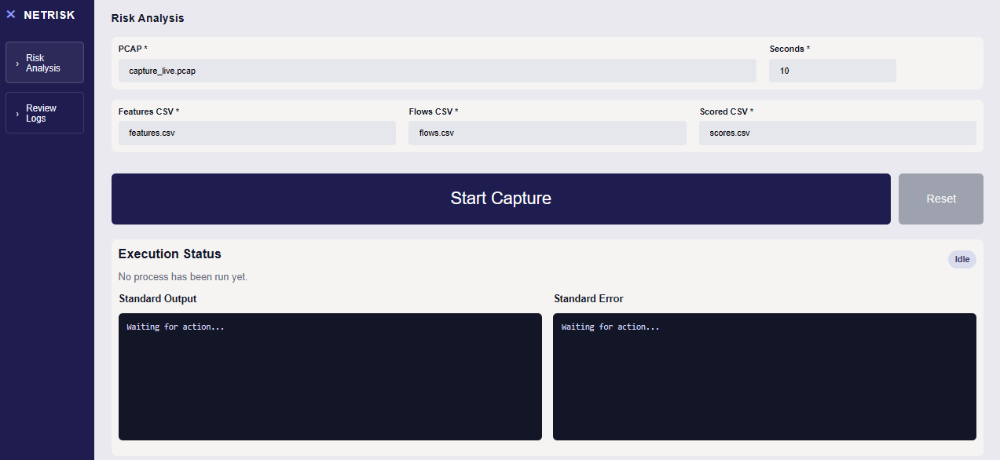
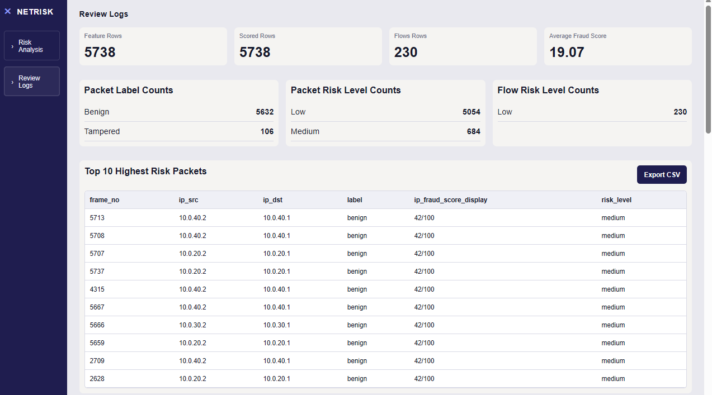
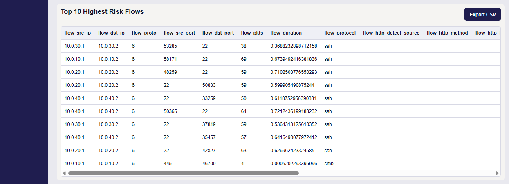
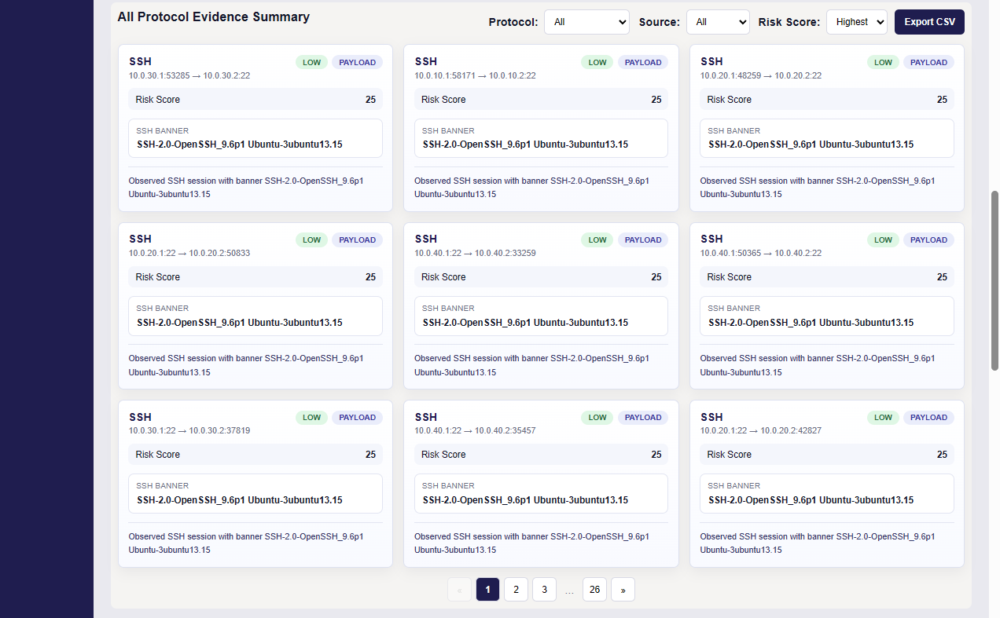
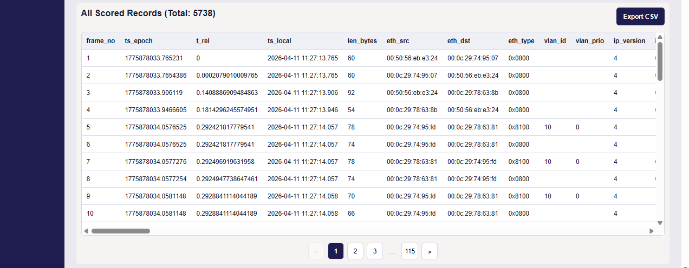
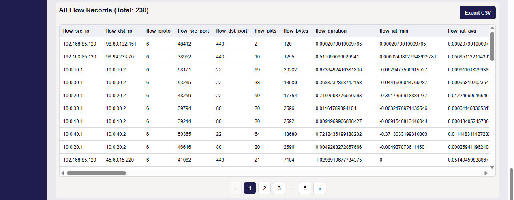
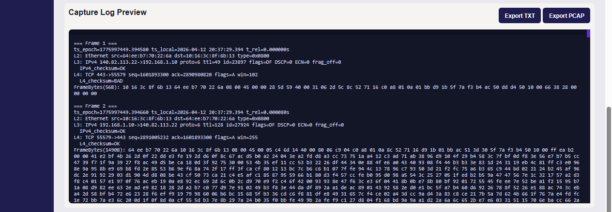

### 0570: Network Traffic Frame Integrity & Threat Classification Header & Flow Analysis with Prototype Detector

A web-based system for **real-time network traffic analysis, frame integrity verification, and threat classification** using:

- L2–L4 header analysis (Scapy)
- Flow-based behavioural analysis
- Machine Learning (Random Forest, SVM, KNN, Decision Tree)
- Interactive SOC-style dashboard (Flask)

> Detection runs entirely on locally computed header and flow features — no
> account and no credentials are required. An optional IP-reputation lookup can
> be switched on through `.env` (see `.env.example`); leave it unset and scoring
> uses the built-in heuristic described in section 8.5.

---

## 1) System Overview

NetRisk is designed as a **lightweight header-based detection system** that overcomes limitations of traditional payload-based security tools.

Unlike DPI systems, this system:

- Works even on **encrypted traffic**
- Detects **frame-level anomalies**
- Provides **explainable risk scoring**

### Core Capabilities

- Live packet capture (PCAP generation)
- L2–L4 header feature extraction
- Flow generation & aggregation
- Protocol identification (HTTP, TLS, SSH, SMB)
- TCP behaviour analysis (SYN/ACK patterns)
- Machine learning classification
- Header & flow based risk scoring
- SOC-style dashboard visualization
- Export results (CSV / TXT / PCAP)

---

## Why This System Matters

Traditional network security systems face critical limitations:

- Deep Packet Inspection (DPI) fails on encrypted traffic
- Flow-based systems (NetFlow) ignore L2 header integrity
- Advanced tools like Zeek may drop malformed packets (e.g., invalid checksum)

This creates a **visibility gap in L2–L4 header integrity verification**.

NetRisk addresses this gap by:

- Analysing raw packet headers (L2–L4)
- Detecting structural anomalies
- Classifying threats without relying on payload data

---

## Comparison with Existing Systems

| Feature | DPI (Snort/Suricata) | NetFlow | Zeek | NetRisk |
|--------|---------------------|--------|------|--------|
| Works on encrypted traffic | ❌ | ✅ | ✅ | ✅ |
| L2 header analysis | ❌ | ❌ | ⚠️ Partial | ✅ |
| Detect malformed frames | ❌ | ❌ | ❌ | ✅ |
| Payload required | ✅ | ❌ | ❌ | ❌ |
| Explainable scoring | ❌ | ❌ | ⚠️ | ✅ |

---

## 2) System Architecture

The system follows a multi-stage detection pipeline:

```text
[Packet Capture]
        ↓
[Feature Extraction (L2–L4)]
        ↓
[Flow Generation & Aggregation]
        ↓
[Protocol Detection + TCP Behaviour Analysis]
        ↓
[Machine Learning Classification]
        ↓
[Risk Scoring (Header + Flow Heuristics)]
        ↓
[Dashboard Visualization & Export]
```

---

## Dashboard Preview

### Risk Analysis Page



Capture control panel — PCAP target, capture duration, output CSV names, and a live execution status console.

### Review Logs Page



Row-count tiles, packet label counts, packet/flow risk-level counts, and the **Top 10 Highest Risk Packets** table.



**Top 10 Highest Risk Flows**, showing protocol hint, ports, packet counts, and flow duration.



**All Protocol Evidence Summary** — one card per flow with protocol, risk score, and the evidence that identified it (e.g. SSH banner, TLS SNI, HTTP host/path). Filterable by protocol, detection source, and risk order.



**All Scored Records** — the complete per-packet feature and scoring table, paginated 50 rows per page.



**All Flow Records** — the complete flow-level aggregation table.



**Capture Log Preview** — the raw per-frame decode (L2/L3/L4 fields, checksum verdicts, and a hex preview of frame bytes).

---

## 3) Project Structure

```text
packet-header_n_frame-analysis/
├── app.py                      # Flask backend (dashboard pages + JSON/export API)
├── fyp1.py                     # Capture, feature extraction, flow & scoring engine
│
├── config.py                   # Shared training defaults & per-model hyperparameters
├── common_args.py              # Shared CLI arguments for the training scripts
│
├── random_forest/
│   ├── train_rf.py
│   ├── rf_model.joblib         # Model loaded by the web app
│   ├── rf_model_meta.json      # Feature list + hyperparameters
│   └── rf_model_report.txt     # Confusion matrix + classification report
├── support_vector_machine/     # train_svm.py + svm_model.*
├── k_nearest_neighbors/        # train_knn.py + knn_model.*
├── decision_tree/              # train_dt.py + dt_model.*
│
├── cleaned_dataset/            # 46 labelled CSVs used for training
│
├── templates/
│   ├── index.html              # Risk Analysis page
│   └── review_logs.html        # Review Logs page
├── static/
│   ├── app.js                  # Capture/score orchestration
│   ├── review_logs.js          # Pagination, filtering, exports
│   └── style.css
│
├── docs/                       # Screenshots used in this README
│
├── capture_live.pcap           # Generated: raw captured packets
├── capture_live.txt            # Generated: human-readable frame decode log
├── features.csv                # Generated: packet-level features
├── flows.csv                   # Generated: flow-level aggregation
├── scores.csv                  # Generated: ML labels + risk scores
│
├── .env.example                # Optional settings template (copy to .env)
├── requirements.txt
└── README.md
```

> Generated artefacts (`*.pcap`, `*.txt`, and `*.csv` outside `cleaned_dataset/`) are excluded by `.gitignore`.

---

## 4) Prerequisites

- Windows 10 / 11
- Npcap (install with WinPcap API-compatible mode)
- Python 3.9 – 3.12
- **Git LFS** — the trained models and training CSVs are stored as LFS objects
- Administrator privileges (required for packet capture)

> ⚠️ The project folder must be named exactly `packet-header_n_frame-analysis`.
> `app.py` resolves its data directory by that literal name, so a renamed clone
> cannot find `fyp1.py`, the model, or any CSV.

---

## 5) Setup

### Clone with Git LFS

`.gitattributes` routes `cleaned_dataset/*.csv` and `*.joblib` through Git LFS
(46 dataset CSVs + 4 model files). Cloning without it leaves pointer files and
the app will fail to load the model.

```bash
git lfs install
git clone <repo-url>
cd packet-header_n_frame-analysis
git lfs pull
```

### Create the environment

```bash
py -m venv .venv
.\.venv\Scripts\activate

python -m pip install --upgrade pip wheel

pip install -r requirements.txt
```

> ⚠️ `requirements.txt` currently lists only Flask, pandas and gunicorn, which is
> **not enough to run the system** — `fyp1.py` also imports scapy, joblib, numpy
> and python-dotenv, and loading the Random Forest model additionally requires
> scikit-learn. Install the full set:

```bash
pip install flask pandas numpy scapy scikit-learn joblib python-dotenv
```

---

## 6) Run the System

```powershell
python app.py
```

Then open:

```text
http://127.0.0.1:5000
```

> The development server starts on port **5000** with debug mode enabled.

---

## 7) How to Use

### Step 1 — Set Capture Duration

On the **Risk Analysis** page, set **Seconds** (minimum 10). The PCAP and CSV filenames are fixed and shown read-only.

### Step 2 — Click **Start Capture**

A single click runs the whole pipeline. The button reports progress as
`Start Capture → Capturing → Analyzing → Recapture`. Output is **not** live —
each stage's standard output and standard error appear in the **Execution Status**
panel only after that stage finishes.

> ⚠️ Starting a capture first **deletes** the previous `capture_live.pcap`,
> `capture_live.txt`, `features.csv`, `flows.csv` and `scores.csv`. Export
> anything you want to keep before recapturing.

**Stage 1 — Capture** (`POST /api/start-capture`)

Runs `fyp1.py` as a subprocess for the requested duration, producing:

- `capture_live.pcap` — raw packets
- `capture_live.txt` — frame decode log
- `features.csv` — packet-level features (78 columns)
- `flows.csv` — flow-level aggregation (56 columns)
- `scores.csv` — `fyp1.py` also runs classification and scoring at the end of its own run

**Stage 2 — Scoring** (`POST /api/score`, started automatically)

The dashboard then re-runs the scoring half in-process, regenerating `scores.csv`:

- ML classification against `random_forest/rf_model.joblib`
- Header + flow risk scoring

Producing:

- `scores.csv` — 89 columns: the packet features plus `label`, `ip_fraud_score`, `ip_fraud_score_display`, `risk_level` and `risk_score_reason`

> Only **Seconds** reaches the capture engine. Every filename is hard-coded
> server-side, which is why the other fields are read-only.

### Step 3 — Open **Review Logs**

Inspect the results: summary tiles, top-risk tables, protocol evidence cards, full record tables, and the capture log — each with CSV export.

> **Reset** restores the form defaults and clears the console panels.

---

## 8) Detection Features

### 1. Protocol Detection (Hybrid)

Payload inspection first (HTTP request line, TLS handshake/SNI, SSH banner, SMB header), with a port-based fallback. Each flow records which method identified it, so the dashboard can show `PAYLOAD` or `PORT` as the evidence source.

| Port | Protocol |
| ---- | -------- |
| 80   | HTTP     |
| 443  | TLS      |
| 22   | SSH      |
| 445  | SMB      |

> These four ports are also the default capture filter:
> `ip and tcp and (port 22 or port 80 or port 443 or port 445)`

---

### 2. TCP Behaviour Analysis

- SYN without ACK → possible scan
- RST-heavy flows → abnormal termination
- Incomplete handshake detection (`syn_seen` / `synack_seen` / `ack_seen_after_synack`)
- Direction imbalance (fwd vs rev packets and bytes)
- Fan-out across unique source/destination ports

---

### 3. Header-Based Anomaly Detection

- Invalid IPv4 / L4 checksum
- Fragmentation anomalies (MF flag, fragment offset)
- Abnormal TTL values
- Suspicious TCP flag combinations
- Unusual DSCP values
- IP-to-MAC binding inconsistency (spoofing suspect)

---

### 4. Machine Learning Classification

Four classifiers are trained on the same 34 header/flow features and predict three classes:

- `attack`
- `benign`
- `tampered`

The web application loads the **Random Forest** model for live scoring.

---

### 5. Risk Scoring

Each packet receives an explainable 0–100 score built from header integrity and flow behaviour. The total is clamped to 0–100 and stored alongside the reason that drove it.

| Condition | Points |
| --------- | ------ |
| IPv4 checksum invalid | +35 |
| L4 checksum invalid | +25 |
| Source IP/MAC binding inconsistent | +20 |
| MF flag set, or fragment offset > 0 | +10 |
| TTL between 1 and 19 | +10 |
| Flow reaches more than 5 unique destination ports | +10 |
| More than 3 SYNs with zero ACKs | +10 |
| TCP flags contain `SF`, or are empty | +5 |
| DSCP outside {0, 8, 16, 24, 32, 46} | +3 |
| Destination port in {22, 80, 443, 445} | +2 |
| Flow risk contribution | + min(25, flow_risk_score ÷ 2) |

**Risk bands**

| Score | Risk level |
| ----- | ---------- |
| 90 – 100 | very high |
| 70 – 89  | high |
| 40 – 69  | medium |
| 0 – 39   | low |

---

## 9) Machine Learning Models

### Training

```bash
python random_forest/train_rf.py
python support_vector_machine/train_svm.py
python k_nearest_neighbors/train_knn.py
python decision_tree/train_dt.py
```

Scripts resolve their data, model and report paths relative to the current
directory, so run them from the repository root.

Shared defaults live in `config.py` and can be overridden on the command line
(`--data-dir`, `--pattern`, `--label-col`, `--chunksize`, `--max-rows`,
`--per-chunk-sample`, `--random-state`, `--rows-per-file`).

> ⚠️ `config.py` sets `label_col` to `"Label"` (capital L), but no dataset file
> has that column — the real name is lowercase `label`. Training works only
> because the scripts fall back to probing a candidate list that tries `label`
> first. Passing `--label-col Label` explicitly will not find the column.

| Setting | Default |
| ------- | ------- |
| Data directory | `cleaned_dataset` |
| File pattern | `*.csv` |
| Chunk size | 200,000 |
| Max rows | 1,500,000 |
| Per-chunk sample | 0.15 |
| Random state | 42 |

### Configured Hyperparameters

| Model | Configuration |
| ----- | ------------- |
| Random Forest | `n_estimators=200`, `max_depth=20`, `class_weight=balanced_subsample` |
| Decision Tree | `criterion=gini`, `max_depth=20`, `min_samples_split=10`, `min_samples_leaf=10`, `class_weight=balanced` |
| SVM | `LinearSVC(C=1.0, class_weight=balanced)`, sigmoid calibration, `cv=3` |
| KNN | `k=25`, `weights=distance`, `metric=minkowski`, `p=2` |

### Results

Evaluated on a held-out test set of 266,352 rows:

| Model | Accuracy | Macro F1 | Weighted F1 | `tampered` F1 |
| ----- | -------- | -------- | ----------- | ------------- |
| Random Forest | 0.9846 | 0.8025 | 0.9878 | 0.4234 |
| Decision Tree | 0.9832 | 0.8049 | 0.9868 | 0.4327 |
| KNN | 0.9826 | 0.7236 | 0.9816 | 0.1989 |
| SVM | 0.9107 | 0.6043 | 0.9070 | 0.0000 |

> The `tampered` class is heavily under-represented (1,457 of 266,352 rows), which
> is why macro F1 sits well below accuracy. The linear SVM does not recover the
> class at all. Random Forest is used in production for its balance of overall
> accuracy and `tampered` recall.

Each model writes three artefacts to its own folder: `*_model.joblib`,
`*_model_meta.json` (feature list + parameters) and `*_model_report.txt`
(confusion matrix + classification report).

> The `.joblib` and `.json` artefacts are versioned, but `*_model_report.txt` is
> excluded by `.gitignore` (`*.txt`) — reports exist only on the machine that
> last trained. Re-run a training script to regenerate them.

---

## 10) Dashboard Features

### Risk Analysis (`/`)

- Capture duration control and read-only output filenames
- **Start Capture** / **Reset** actions
- Live status badge (Idle / Running / Success / Error)
- Standard output and standard error consoles

### Review Logs (`/review-logs`)

- Feature, scored and flow row counts, plus average risk score
- Packet label counts and packet/flow risk-level counts
- Top 10 highest risk packets
- Top 10 highest risk flows
- Protocol evidence cards, filterable by protocol, detection source and risk order (9 per page)
- All scored records and all flow records (50 per page)
- Capture log preview

---

## 11) Export Features

Every panel on the Review Logs page exports its current data set.

| Export | Endpoint |
| ------ | -------- |
| Top 10 highest risk packets | `/api/export/top-packets` |
| Top 10 highest risk flows | `/api/export/top-flows` |
| All scored records | `/api/export/records` |
| All flow records | `/api/export/flows` |
| Protocol evidence (respects filters) | `/api/export/protocol-evidence` |
| Capture log (TXT) | `/api/export/capture-log` |
| Raw capture (PCAP) | `/api/export/capture-log-pcap` |

**Filename format**

```text
YYYYMMDD_HHMM_basename.ext
```

**Example**

```text
20260412_1449_all_scored_records.csv
```

---

## 12) CLI Usage

**List interfaces**

```bash
python fyp1.py -l
```

**Capture traffic for 10 seconds**

```bash
python fyp1.py -t 10
```

**Custom interface**

```bash
python fyp1.py --ifaces \Device\NPF_{GUID} -t 10
```

> ⚠️ Use `--ifaces` (plural). The `-i` / `--iface` flag is parsed but **never
> read** by the capture code — passing it has no effect and the interface is
> still auto-selected.

### Options

| Flag | Default | Description |
| ---- | ------- | ----------- |
| `-l`, `--list` | — | List available capture interfaces and exit |
| `--ifaces` | auto | Comma-separated device names to sniff (overrides auto selection) |
| `-i`, `--iface` | — | Declared but non-functional — use `--ifaces` |
| `--include-virtual` | off | Include virtual/WAN/loopback adapters as candidates |
| `-f`, `--bpf` | `ip and tcp and (port 22 or port 80 or port 443 or port 445)` | BPF capture filter |
| `-t`, `--seconds` | `0` | Capture duration in seconds |
| `-c`, `--count` | `0` | Stop after N packets |
| `-o`, `--outfile` | `capture_live.pcap` | PCAP output path |
| `--log` | `capture_live.txt` | Frame decode log path |
| `--features-csv` | `features.csv` | Packet feature CSV output |
| `--features-parquet` | — | Optional Parquet output (requires pyarrow) |
| `--preview-only` | off | Decode and preview without writing outputs |
| `--preview-bytes` | `32` | Bytes of frame payload to preview |

---

## 13) Dataset

### Training data

`cleaned_dataset/` holds 46 labelled, pre-cleaned CSVs (~5.3 GB, stored in Git LFS).
All 46 share one identical **39-column schema** ending in a lowercase `label`
column — a strict subset of the 78 columns `features.csv` produces live, so the
training schema omits the L2/identity fields (MAC addresses, IP addresses,
protocol-evidence columns) that only exist at capture time.

They are drawn from several public capture families:

- **CTU-IoT-Malware-Capture** — IoT malware traffic (benign and infected)
- **BOUN** — anonymised TCP and UDP university traffic
- **CIC-IDS style day captures** — Monday–Friday benign baselines
- **DoS tool captures** — Hulk, GoldenEye, Slowloris, SlowHTTPTest, LOIC
- **Web attack captures** — brute force, SQL injection, XSS
- **SSH Patator**, **zero-day attack detection** sets, and normal/DoS/malware VM captures

Training auto-detects the label column (`label`, `Label`, `class`, `Category`, …)
and normalises values through a canonical map — `normal`/`good` → `benign`,
`malicious`/`anomaly`/`bad` → `attack`, `tainted` → `tampered`.

> ⚠️ Only exact single-token matches are mapped. Any label that does not resolve
> to `benign`, `attack` or `tampered` is **dropped**, not reclassified — so
> multi-word CTU labels such as `Malicious   C&C` and `Malicious   FileDownload`
> are silently excluded from training.

### Live data

Traffic captured in a VM environment across HTTP, TLS, SSH and SMB, containing
both normal and anomalous patterns.

---

## 14) Key Contribution

This project introduces a:

- Lightweight header-only detection framework for encrypted traffic environments

**Unlike traditional systems:**

- No payload dependency
- No signature reliance
- No external threat-intelligence service
- Works on encrypted traffic
- Detects frame-level anomalies

---

## 15) Future Improvements

- Deep learning model (LSTM / Autoencoder)
- Real-time streaming detection
- Improved handling of the imbalanced `tampered` class
- SIEM integration
- Advanced attack simulation (DDoS, MITM)

---

## 16) Security Note

- Packet capture requires administrator privileges — run only on networks you are authorised to monitor
- Captured PCAP, CSV and log files may contain sensitive traffic; they are excluded by `.gitignore` and should not be committed
- The Flask development server runs with `debug=True` and is intended for local use only — do not expose it to untrusted networks

### Known limitations of this prototype

This is a research prototype, not a hardened deployment. Before using it anywhere
beyond an isolated lab, be aware that:

- **No authentication or CSRF protection.** All routes are open, including the two
  `POST` endpoints that start a packet capture and load a ~134 MB model — anyone
  who can reach the port can trigger them.
- **Captured traffic is rendered unescaped.** The Review Logs tables and protocol
  cards interpolate CSV values straight into `innerHTML`, so attacker-controlled
  fields (`flow_http_host`, `flow_http_path`, `flow_tls_sni`, `flow_ssh_banner`)
  can execute script in the analyst's browser. Monitored traffic is untrusted
  input — treat it as such.
- **The whole capture log is inlined into the page** on every Review Logs request,
  so response size grows with the log file.
